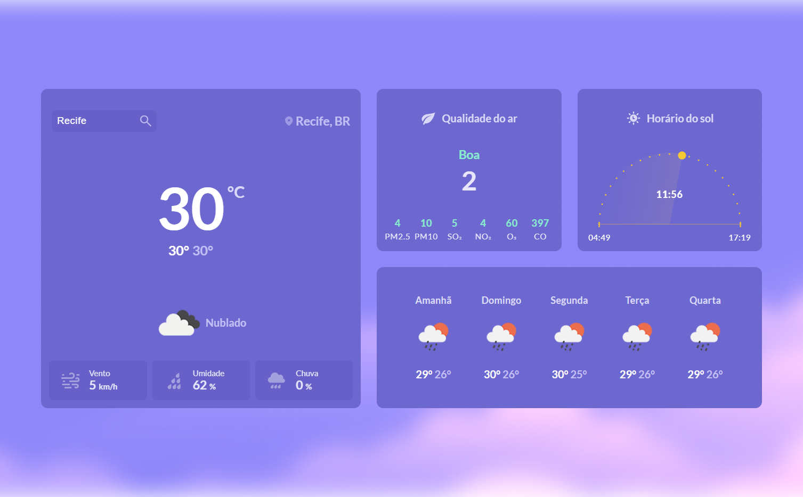
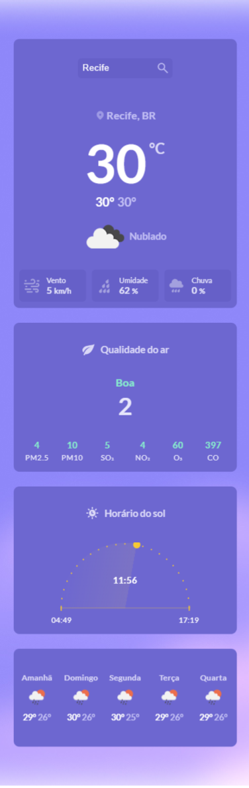

<h1 align='center'>Weather</h1>

A Weather application challenge of Rocketseat. In this app I am using HTML, CSS, JavaScript, Sweet Alert and OpenWeather API.

## Features Developed

- [x] Search a city and get weather informations
- [x] Wind speed, humidity and rain
- [x] Air quality conditions
- [x] Local time, sunrise and sunset
- [x] Responsivity

## Screenshots

The interface

Mobile version

## Prototype

You can access the Rocketseat prototype by clicking the button below.

## Technologies

## Services Used

</a>

## Deploy

You can access the project by clicking the button below.

## Autor

<table>
  <tr>
    <td align="center">
      <a href="https://github.com/leonardo-ad">
       
      <b>Leonardo Alves Dias</b>
        
      <a href="https://www.linkedin.com/in/leonardo-alves-877368165/"> 
    </td>
   </tr>
</table>
